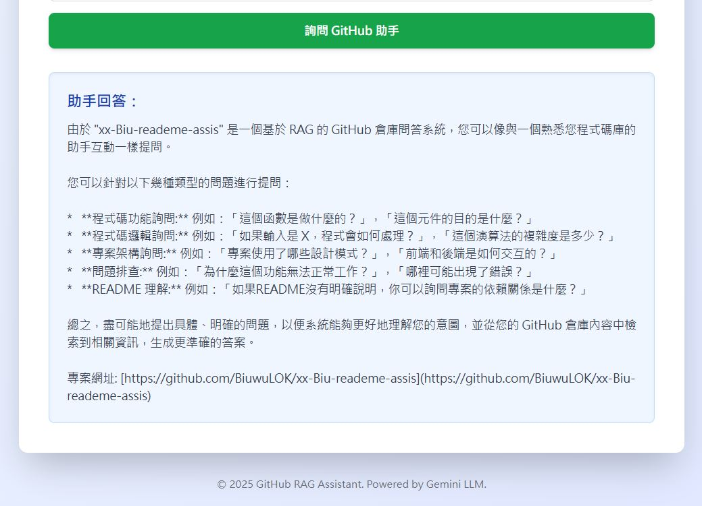

# xx-Biu-reademe-assis-app (The RAG Readme App)

## 專案簡介

這是一個基於 Retrieval Augmented Generation (RAG) 的應用程式，支援多後端（FastAPI、Node.js）與 React 前端，並整合 CI/CD 流程。專案採用 monorepo 架構，方便多服務協作與自動化部署。

## Demo

### Try it out
[Try The Demo](https://gemini.google.com/share/5c9e937d9566)
<div align="center">
  
</div>

#### How can you ask it
<div align="center">
  
  
</div>

#### How can you use it in text
- **專案的主要功能是什麼?**  **專案使用了哪些主要技術?**
- **專案的架構是怎樣的?**   **專案如何幫助使用者?** 
- **專案的核心技術是什麼?** 

* **程式碼功能詢問:** 例如:「這個函數是做什麼的?」，「這個元件的目的是什麼?」
* **程式碼邏輯詢問:** 例如:「如果輸入是X,程式會如何處理?」，「這個演算法的複雜度是多少?」
* **專案架構詢問:** 例如:「專案使用了哪些設計模式?」,「前端和後端是如何交互的?」
* **問題排査:** 例如:「為什麼這個功能無法正常工作?」，「哪裡可能出現了錯誤?」
* **README 理解:** 例如:「如果README沒有明確說明,你可以詢問專案的依賴關像是什麼?」

## 專案結構

```
xx-Biu-reademe-assis-app/
├── .github/                     # GitHub Actions (CI/CD) 設定
│   └── workflows/
│       ├── deploy-react.yml     # 部署 React 前端
│       ├── deploy-fastapi.yml   # 部署 FastAPI 後端
│       └── deploy-nodejs.yml    # 部署 Node.js 後端
├── react/                       # React 前端程式碼
├── fastapi/                     # FastAPI 後端程式碼
├── nodejs/                      # Node.js 微服務程式碼
├── shared/                      # 共用函式/型別（可選）
├── .gitignore                   # Git 忽略文件
├── package.json                 # 根層級管理（可用於 Lerna/Nx 等 monorepo 工具）
├── requirements.txt             # 全域 Python 工具依賴（可選）
├── .editorconfig                # 編輯器統一設定（建議）
├── .prettierrc                  # Prettier 設定（建議）
├── .eslintrc.js                 # ESLint 設定（建議）
├── .env.example                 # 環境變數範例（建議）
└── README.md                    # 專案說明文件
```

### 各資料夾簡介
- `.github/workflows/`：CI/CD 自動化部署與測試流程。
- `react/`：前端 React 專案，建議使用 Vite + Tailwind CSS。
- `fastapi/`：Python FastAPI 後端服務。
- `nodejs/`：Node.js 微服務（可多個子服務）。
- `shared/`：多服務共用的工具、型別或常數（可選）。

## 環境建置與安裝

請確保您的系統已安裝 Python 3.8+、Node.js 16+。

### 前端（React）
```bash
cd react
npm install
npm run dev
```

### FastAPI 後端
```bash
cd fastapi
python -m venv venv
source venv/bin/activate
pip install -r requirements.txt
uvicorn main:app --reload
```

### Node.js 微服務
```bash
cd nodejs
npm install
npm run dev # 或 node app.js
```

### 多服務本地啟動建議
可於根目錄安裝 concurrently，並於 package.json scripts 加入：
```json
"scripts": {
  "dev": "concurrently 'npm --prefix react run dev' 'uvicorn fastapi/main:app --reload' 'npm --prefix nodejs run dev'"
}
```

## 開發建議與最佳實踐
- 建議加入 `.editorconfig`、`.prettierrc`、`.eslintrc.js` 統一團隊程式碼風格。
- 建議於 `shared/` 放置共用工具或型別，減少重複。
- CI/CD 流程可自動執行 lint、test、build 與部署。
- 各服務可獨立部署、測試與擴展。
- 建議於根目錄提供 `.env.example`，統一管理環境變數。

## 使用技術
- **前端**: React, Vite, Tailwind CSS
- **後端**: Python FastAPI, Node.js (Express/Koa 等)
- **RAG**: （請補充使用的 RAG 相關庫，如 LangChain, LlamaIndex 等）
- **資料庫/向量儲存**: （如有請補充）
- **LLM**: （請補充具體 LLM，如 OpenAI GPT 系列）

## 貢獻
歡迎對此專案做出貢獻。請先 Fork 本倉庫，創建新分支，提交修改後發起 Pull Request。

## 許可證
本專案採用 MIT 許可證 - 詳細內容請參閱 [LICENSE](LICENSE)。

## 聯繫方式
如有任何問題或建議，歡迎聯繫我。

---

> 本 README 由 Copilot 協助優化。
